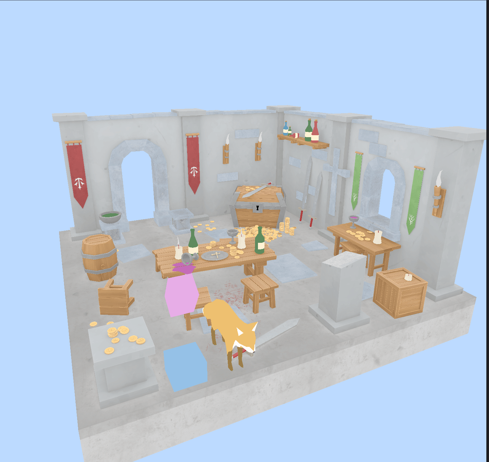
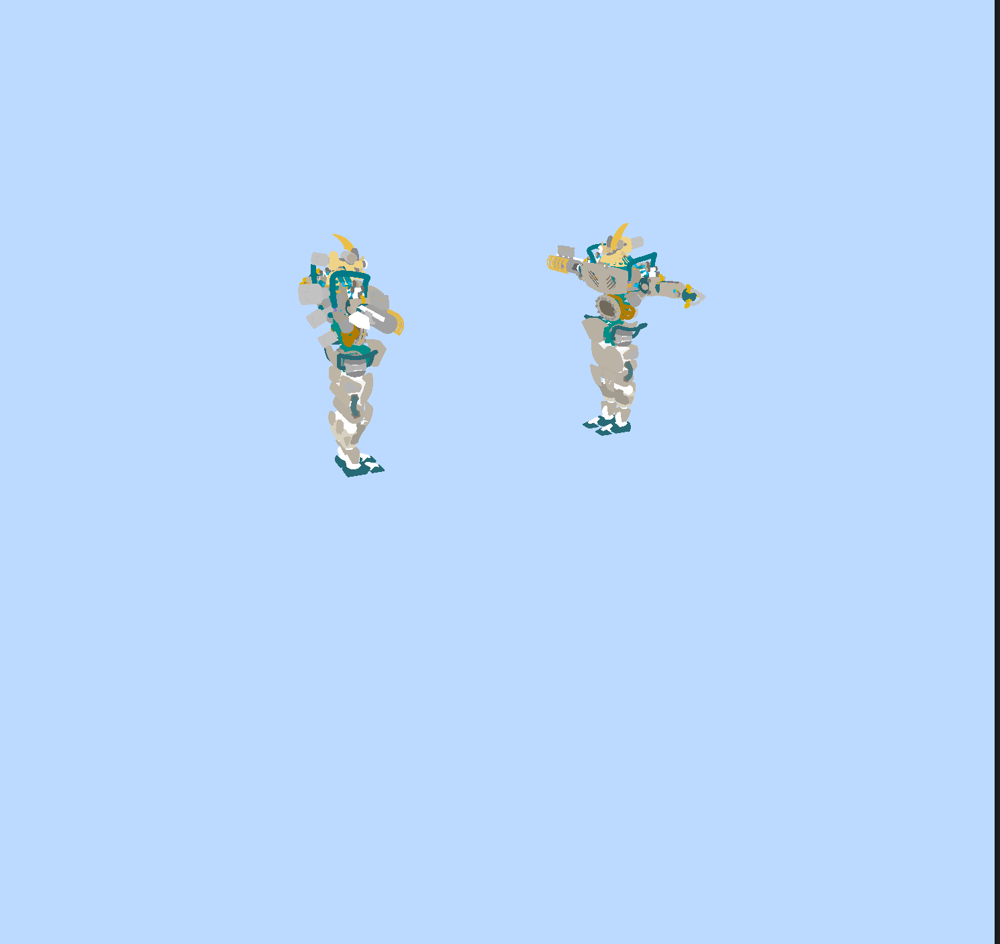

An in progress game engine made from scratch using wgpu and winit

## Current capabilities

- Asset manager with async + lazy loading of external textures, materials, gltf files
- Entity component system, support for arbitrary entity spawns
- CPU driven animation system, skinned animation support
- Custom GPU buffer data allocation, runtime spawn, despawn, asset dependency analysis
- Bytecode driven renderer, with zero dependencies on the in crate ECS, can be driven with any bytecode provider.

